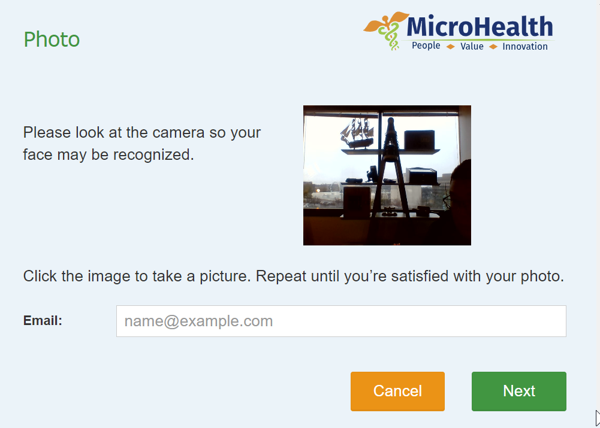

# mVMS
Simple visitor management system that you can brand.  Simple check in works on any chrome based browser.  Few check in screens that is mobile friendly.  We have it working on older ipads.  Print out works on inexpensive label printers. We use the Brother desktop label printer.  The admin screen shows a list of everyone who visted, when, why, their photo, dates and times etc.

# update centos

yum update

yum install -y epel-release yum-utils

yum-config-manager --enable epel

yum clean all && sudo yum update -y

# install ruby

gpg --keyserver hkp://keys.gnupg.net --recv-keys 409B6B1796C275462A1703113804BB82D39DC0E3

curl -sSL https://get.rvm.io | sudo bash -s stable

usermod -a -G rvm `username'

export PATH="$PATH:$HOME/.rvm/bin"

log out then log back in

rvm install ruby-2.3.6

rvm install ruby-devel-2.3.6

bash -l -c "rvm use 2.3.6 --default"

# Install Mysql
yum install mariadb-server mariadb

yum install mysql-devel

systemctl start mariadb

systemctl enable mariadb

mysql_secure_installation

mysql -u root -p

create database mvms_prod CHARACTER SET utf8 COLLATE utf8_general_ci;

exit

# be sure git is installed
yum install git

# go to /var/www and from there 
cd /var/www/

git clone https://github.com/iFixtechLLC/mVMS

nano /var/www/mVMS/config/database.yml

--enter the password for mysql where it says password then save and exit

# go to the cloned directory 
cd /var/www/mVMS 

gem install rails

gem install bundler

yum install nodejs

bundle install

rails db:setup 

rake assets:precompile

# generate your secrets for config/secrets.yml

rake secret

put that output in config/secretys.yml

# Configure Nginx repo for CentOS 7

nano /etc/yum.repos.d/nginx.repo

# then enter this below and save

[nginx]

name=nginx repo

baseurl=http://nginx.org/packages/mainline/centos/7/$basearch/

gpgcheck=0

enabled=1

# Update yum and install nginx
yum update

yum install -y nginx

sudo systemctl enable nginx

# install passenger phusion

yum install -y pygpgme curl

curl --fail -sSLo /etc/yum.repos.d/passenger.repo https://oss-binaries.phusionpassenger.com/yum/definitions/el-passenger.repo

yum install -y nginx passenger || sudo yum-config-manager --enable cr && sudo yum install -y nginx passenger

# then go edit passenger.conf
nano /etc/nginx/conf.d/passenger.conf

# -where it says passenger_ruby change what you see there to what you see below.  If that doesn't work then do this "which passenger-config" to get the path to put next to passenger_ruby

passenger_ruby /usr/local/rvm/gems/ruby-2.3.6/wrappers/ruby;

--uncomment the line above and the line below along with the passenger_ruby line e.g. remove this"#"

echo fs.inotify.max_user_watches=524288 | sudo tee -a /etc/sysctl.conf && sudo sysctl -p

# edit nginx.conf
nano /etc/nginx/nginx.conf
add these

        passenger_enabled on;
        rails_env production;

# restart nginx
service nginx restart

# Setup
go to https://your-url/admin

login with temp account admin with password Admin@2018

Change, configure and customize your instance

